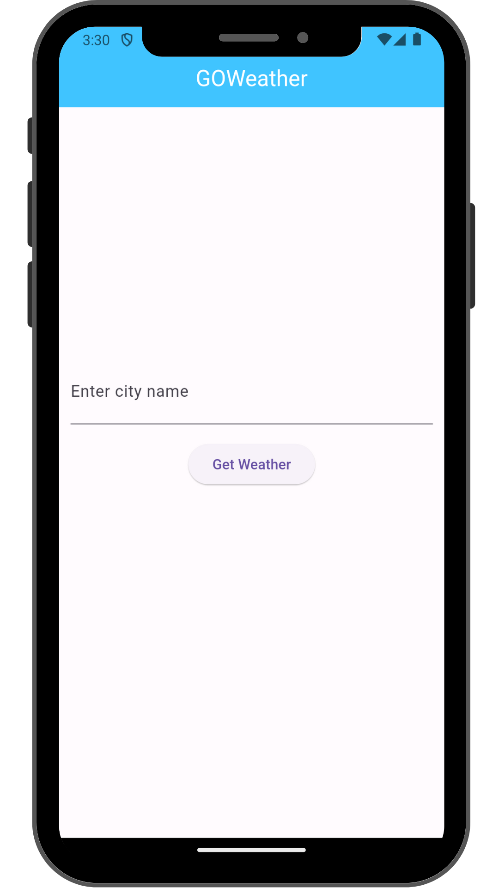
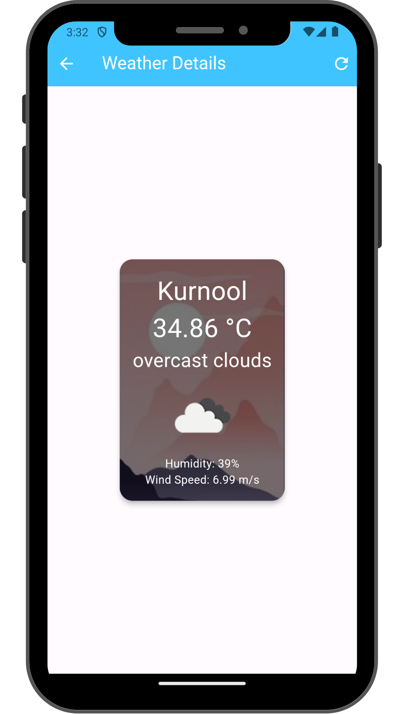

# GOWeather App

A simple Flutter application to fetch and display weather information using the OpenWeatherMap API.

## Features

1. **Search Bar**: Allows users to enter a city name to fetch weather data.
2. **Weather Details Screen**: Displays detailed weather information for the searched city.
3. **Loading Indicator**: Shows a loading indicator while fetching weather data.
4. **Error Handling**: Properly handles API request errors and displays user-friendly error messages.
5. **Responsive Design**: Basic responsive design that works on both mobile and tablet devices.
6. **Refresh Button**: Allows users to refresh and fetch updated weather data.
7. **Data Persistence**: Stores the last searched city using local storage.

## Screenshots
  ### Responsive Phone:




## Getting Started

To run this project locally, follow these steps:

1. Clone the repository:

   ```bash
   git clone https://github.com/your_username/flutter_weather_app.git

