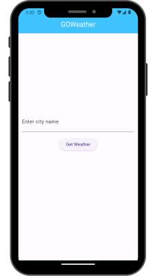
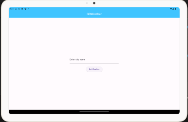

# GOWeather App

A simple Flutter application to fetch and display weather information using the OpenWeatherMap API.

## Features

1. **Search Bar**: Allows users to enter a city name to fetch weather data.
2. **Weather Details Screen**: Displays detailed weather information for the searched city.
3. **Loading Indicator**: Shows a loading indicator while fetching weather data.
4. **Error Handling**: Properly handles API request errors and displays user-friendly error messages.
5. **Responsive Design**: Basic responsive design that works on both mobile and tablet devices.
6. **Refresh Button**: Allows users to refresh and fetch updated weather data.
7. **Data Persistence**: Stores the last searched city using local storage.

## Screenshots
  ### Responsive Phone:
  ### HomeScreen:&nbsp;&nbsp;&nbsp;&nbsp;&nbsp;&nbsp;&nbsp;&nbsp;&nbsp;&nbsp;&nbsp;&nbsp;&nbsp;&nbsp;&nbsp;&nbsp;&nbsp;&nbsp;&nbsp;&nbsp;&nbsp;&nbsp;&nbsp;&nbsp;&nbsp;Weather Details Screen:
   &nbsp;&nbsp;&nbsp;
  

  ### Responsive Tablet:
  ### HomeScreen:&nbsp;&nbsp;&nbsp;&nbsp;&nbsp;&nbsp;&nbsp;&nbsp;&nbsp;&nbsp;&nbsp;&nbsp;&nbsp;&nbsp;&nbsp;&nbsp;&nbsp;&nbsp;&nbsp;&nbsp;&nbsp;&nbsp;&nbsp;&nbsp;&nbsp;&nbsp;&nbsp;&nbsp;&nbsp;&nbsp;&nbsp;&nbsp;&nbsp;&nbsp;&nbsp;&nbsp;&nbsp;&nbsp;&nbsp;&nbsp;&nbsp;&nbsp;&nbsp;&nbsp;&nbsp;&nbsp;&nbsp;&nbsp;&nbsp;&nbsp;&nbsp;&nbsp;&nbsp;&nbsp;&nbsp; Weather Details Screen:
   &nbsp;&nbsp;&nbsp;
  

## Getting Started

To run this project locally, follow these steps:

1. Clone the repository:

   ```bash
   git clone https://github.com/your_username/flutter_weather_app.git
      ```
2. Navigate into the project directory:

   ```bash
   cd flutter_weather_app
      ```
 3. Install dependencies:

     - **http**: For making HTTP requests to the OpenWeatherMap API.
     - **provider**: State management library for managing application state.
     - **shared_preferences**: For storing the last searched city locally.
       
       ```bash
       flutter pub get
       ```
 4. Change the api_key in weather_service by getting api_key in OpenweatherMap Api:

     ```bash
     API_KEY=your_actual_openweathermap_api_key
     ```
 5. Run the app:

       ```bash
       flutter run
       ```
       
## Usage

1. On the home screen, enter a city name in the search bar and press the search button.
2. The app will display a loading indicator while fetching the weather data.
3. On the weather details screen, view the weather information for the entered city.
4. Press the refresh button to fetch updated weather data.
5. The app saves the last searched city and reloads it on startup.

## Apk file

[APK File](ApkFile.apk)


## License

This project is licensed under the MIT License - see the [LICENSE](LICENSE) file for details.
       
       

